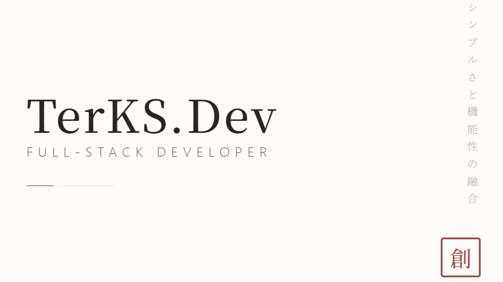
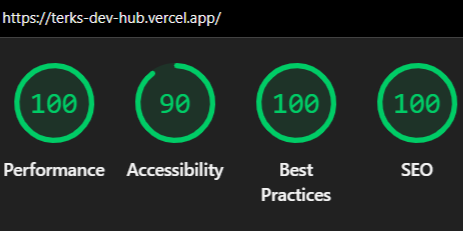

<div align="center">

# 創 TerKS.Dev

**Creative Full-Stack Developer Portfolio**

_シンプルさと機能性の融合 — The fusion of simplicity and functionality_

[](https://terks.dev)
[](https://nextjs.org/)
[](https://www.typescriptlang.org/)
[](https://tailwindcss.com/)



</div>

---

## 侘寂 — Design Philosophy

This portfolio draws from **Wabi-Sabi** (侘寂) — the Japanese aesthetic of finding beauty in imperfection and simplicity. Every layout decision embraces **Ma** (間, negative space), muted Washi-paper tones, and editorial typography to create a calm, gallery-like browsing experience.

It is not merely a showcase of code — it is a demonstration of UI/UX restraint and typographic discipline.

## 〇一 Features

- **Framer Motion Animations** — Scroll-triggered and mount animations with staggered reveals
- **Zen-Inspired UI** — Custom palette: `#FDFCF8` (Washi Paper), `stone` grays, `#8B3A3A` (Hanko Red)
- **Editorial Typography** — Serif / Sans-Serif balance with vertical Japanese text anchors
- **Grayscale → Color Hover** — Project images transition from B&W to full color on hover
- **Smooth Anchor Navigation** — Sticky header with underline-sweep nav animations

## 〇二 Tech Stack

| Layer      | Technology                                                          |
| ---------- | ------------------------------------------------------------------- |
| Framework  | [Next.js 16](https://nextjs.org/) (App Router)                      |
| Language   | TypeScript 5                                                        |
| Styling    | [Tailwind CSS v4](https://tailwindcss.com/)                         |
| Animations | [Framer Motion](https://www.framer-motion.com/)                     |
| Icons      | [React Icons](https://react-icons.github.io/react-icons/) — Feather |
| Typography | Google Fonts — Playfair Display, Inter, Noto Serif JP               |
| Deployment | [Vercel](https://vercel.com/)                                       |

## 〇三 Project Structure

```
app/
├── _components/
│   ├── Header.tsx     # Sticky nav with slide-down animation
│   ├── Hero.tsx       # Landing section with staggered text reveal
│   ├── Expertise.tsx  # Skills grid with scroll-triggered cards
│   ├── Project.tsx    # Alternating project showcase
│   └── Footer.tsx     # Contact & socials
├── globals.css
├── layout.tsx
└── page.tsx
```

## 〇四 Lighthouse Score

<div align="center">
  
</div>

## 〇五 Use This Template

Feel free to use this portfolio as a template for your own. Clone it, modify it, make it yours — no attribution required.

```bash
git clone https://github.com/TerKSDev/terks-dev-hub.git
```

---

<div align="center">

_© 2026 TerKS.Dev — Built with intention._

</div>
